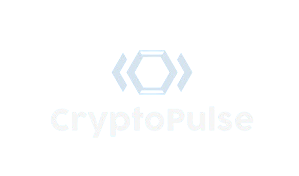
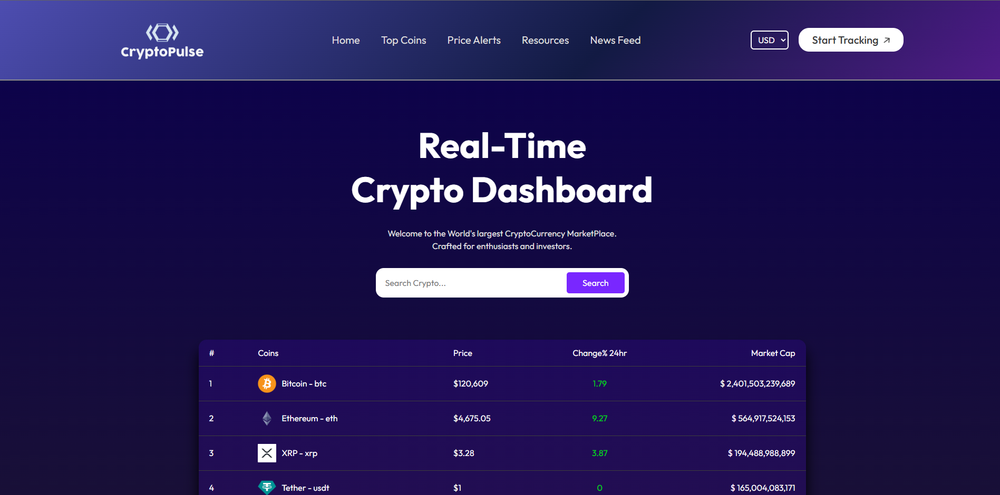
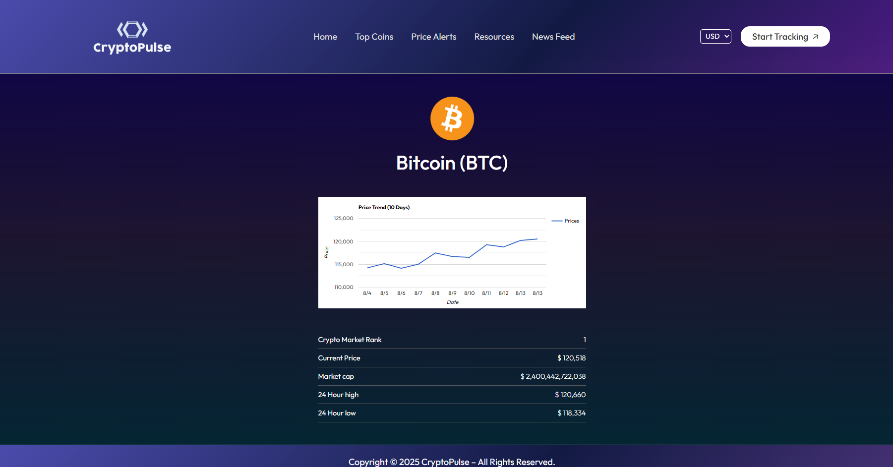

  

# 👋 Hi, I'm Priyanshu Negi 💻!

# 🚀 CrypoPulse — Track Crypto Like Never Before 🔍

 

[**Visit Live Demo**](https://crypto-pulse-track.netlify.app/) 🚀

---

## 🛠️ Tech Stack

- **API :** CoinGecko API  
- **Deployment :** Netlify

---

## ✨ Features

| Feature           | Benefit                     |
|-------------------|-----------------------------|
| 🔥 Live Price Tracking      | Real-time prices of top cryptocurrencies.      |
| 🎯 Search Functionality     | Quickly find your favorite cryptocurrencies.    |
| 📊 Market Data             | Access market cap, volume, 24-hour price changes. |
| 🌎 Responsive Design       | Optimized for desktop & mobile.                   |

> **Fast, responsive, and visually stunning.**

---

## 🚀 Getting Started

### Prerequisites
Make sure you have [Node.js](https://nodejs.org/) and npm installed.

### Installation
Clone the repo and install dependencies:

### `git clone https://github.com/yourusername/your-repo.git`
### `cd [your-repo-folder]`
### `npm install'`

### Development Mode
Run the app locally:   

### `npm start`

Open [http://localhost:3000](http://localhost:3000) in your browser.  
The app reloads on every change.

### Running Tests
To launch the test runner:

### `npm test`

### Building for Production
Build optimized production files:

### `npm run build`

Production files are in the `build` folder, ready to deploy.

---

## 👀 Sneak Peek

  
   
   
  

---

## 🔮 Future Enhancements

- **User Authentication:** Personalized watchlists and profiles.  
- **Historical Data Charts:** Interactive, detailed price history visualizations.  
- **Currency Conversion:** Support for multiple fiat currencies.  

---

## 💬 Feedback

I’d love to hear your thoughts and suggestions!  
Contact me at: [itspriyanshunegi@gmail.com](mailto:itspriyanshunegi@gmail.com)

---

## 📬 Contact Me

---

*Thank you for checking out CryptoPulse!*
